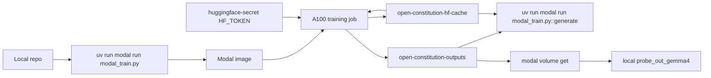
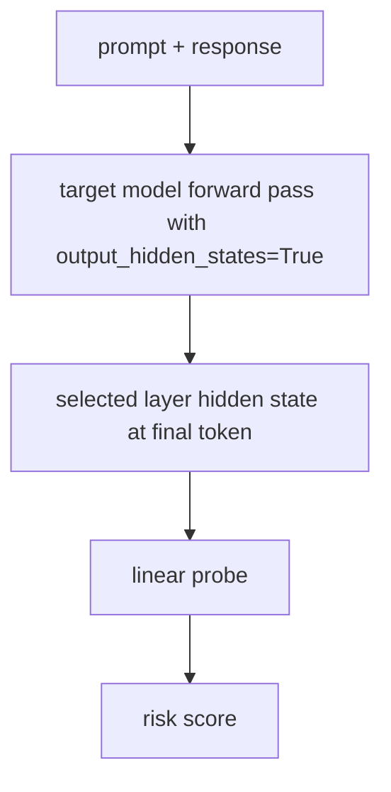
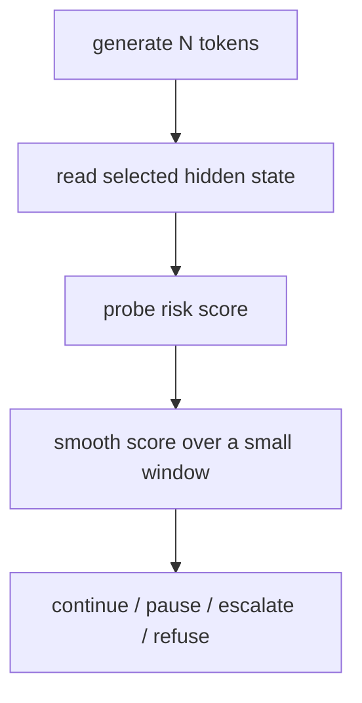

# Open Constitution

A minimal Python + PyTorch + Transformers research project for Anthropic-style activation probes on open-weight models.

It does three things:

1. Collects hidden-state activations from a target model.
2. Trains a tiny linear probe to classify safe vs unsafe exchanges.
3. Runs a guarded generation loop that probes hidden states during generation and pauses/escalates when risk rises.

This is a research MVP, not production-ready safety infrastructure.

## Install

Install `uv` if you do not already have it:

```bash
curl -LsSf https://astral.sh/uv/install.sh | sh
```

Then install the project dependencies:

```bash
uv sync
```

## Quick start

The default model is Gemma 4 E2B. It is smaller than many frontier models, but still needs substantial disk and memory:

```bash
uv run train-probe \
  --model_id google/gemma-4-E2B-it \
  --data_path data/examples.jsonl \
  --layer -4 \
  --out_dir ./probe_out
```

Then run guarded generation:

```bash
uv run guarded-generate \
  --model_id google/gemma-4-E2B-it \
  --probe_path ./probe_out/probe.pt \
  --config_path ./probe_out/config.json \
  --prompt "Explain SQL injection at a high level"
```

## Modal training

Use Modal when the model download or GPU memory is too large for your local machine. The
Modal runner uses an A100 GPU by default and persists Hugging Face downloads plus probe
outputs in Modal Volumes.



Confirm that Modal is authenticated:

```bash
uv run modal profile current
```

Create the Hugging Face token secret once so model downloads are authenticated:

```bash
uv run modal secret create huggingface-secret HF_TOKEN=$HF_TOKEN
```

Run Gemma 4 probe training on Modal:

```bash
uv run modal run modal_train.py
```

Run guarded generation on Modal using the saved probe, without downloading the model or probe
locally:

```bash
uv run modal run modal_train.py::generate \
  --prompt "Explain SQL injection at a high level"
```

Download the saved probe outputs after the job finishes:

```bash
uv run modal volume get open-constitution-outputs probe_out_gemma4 ./probe_out_gemma4
```

The first run downloads the model into the `open-constitution-hf-cache` Modal Volume. Later
runs reuse that cache. If your Modal workspace supports larger GPUs and you want extra
headroom, change `gpu="A100"` to `gpu="A100-80GB"` in `modal_train.py`.

## Data format

`data/examples.jsonl` expects one JSON object per line:

```json
{"prompt":"...", "response":"...", "label":0}
{"prompt":"...", "response":"...", "label":1}
```

Where:

- `label: 0` = safe / allowed
- `label: 1` = restricted / unsafe

For a real probe, you need thousands of examples across allowed and disallowed policy boundaries.

## Architecture



During generation:



## Important limitations

This MVP:

- Uses the final token hidden state only.
- Trains a simple linear probe.
- Uses tiny example data.
- Does not implement Anthropic's exact training tricks.
- Does not patch vLLM.
- Does not replace a real exchange classifier.

Recommended next steps:

1. Generate a serious policy dataset.
2. Test multiple layers and layer combinations.
3. Add token-level labels or soft token weighting.
4. Add score smoothing and calibration curves.
5. Add a second-stage exchange classifier.
6. Integrate into vLLM once the probe is validated.


## Gemma 4 support

The default model is now:

```bash
google/gemma-4-E2B-it
```

Gemma 4 on Hugging Face uses `AutoProcessor` + `AutoModelForImageTextToText`, while many text-only models use `AutoTokenizer` + `AutoModelForCausalLM`. The MVP handles both.

The repo also uses model chat templates by default through:

```python
tokenizer_or_processor.apply_chat_template(...)
```

or, if the processor wraps a tokenizer:

```python
tokenizer_or_processor.tokenizer.apply_chat_template(...)
```

Disable chat templates with:

```bash
--no_chat_template
```

Example Gemma 4 run:

```bash
uv run train-probe \
  --model_id google/gemma-4-E2B-it \
  --data_path data/examples.jsonl \
  --layer -4 \
  --out_dir ./probe_out_gemma4
```

Then:

```bash
uv run guarded-generate \
  --model_id google/gemma-4-E2B-it \
  --probe_path ./probe_out_gemma4/probe.pt \
  --config_path ./probe_out_gemma4/config.json \
  --prompt "Explain SQL injection at a high level"
```

Layer sweep:

```bash
uv run sweep-layers \
  --model_id google/gemma-4-E2B-it \
  --data_path data/examples.jsonl \
  --layers="-2,-4,-6,-8,-10,-12"
```

Note: Gemma models may require accepting Google's license terms on Hugging Face before download. `google/gemma-4-E2B-it` downloads about 10 GB of weights, so use a machine or cloud runtime with enough free disk space.
