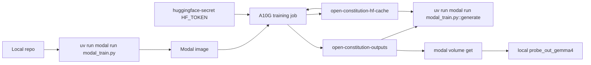
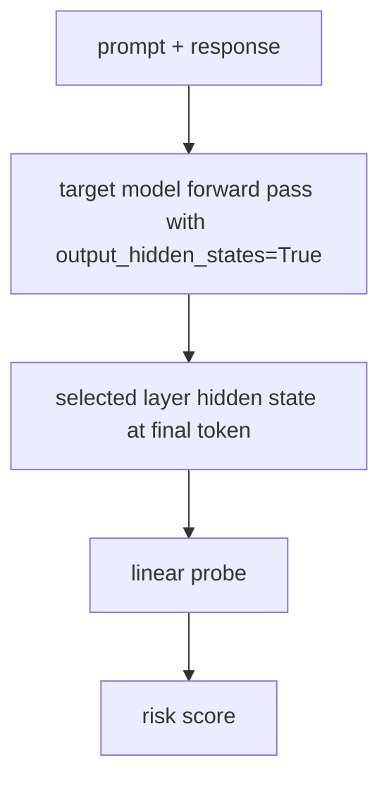
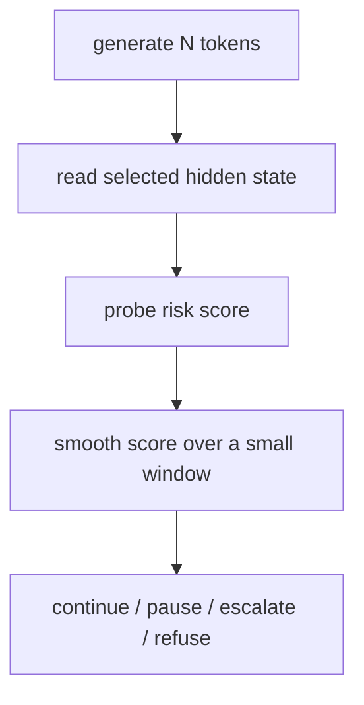

# Open Constitution

**Frontier safety for open-weight models**

A minimal Python + PyTorch + Transformers research project for Anthropic-style activation probes on open-weight models.

It does four things:

1. Collects hidden-state activations from a target model.
2. Trains a tiny linear probe to classify safe vs unsafe exchanges.
3. Runs a guarded generation loop that probes hidden states during generation and pauses/escalates when risk rises.
4. Trains and runs a ModernBERT exchange classifier when the probe pauses. The current best classifier is a three-class model: safe compliance, safe refusal, and unsafe compliance.

This is a research MVP. It is useful enough to benchmark and iterate on, but it should not be treated as production safety infrastructure without more evaluation.

## Current Baseline

The best guardrail configuration in the Modal output volume (superagentai workspace) is:

```text
probe_dir: probe_out_gemma4_fresh_prod
classifier_dir: classifier_out_modernbert_threeclass_v4_toxicchat_prod_fixed
classifier_block_threshold: 0.459937
final_classifier_check: true
refusal: "I can't help with that request. I can help with safe, lawful alternatives instead."
```

Why these values:

- `classifier_out_modernbert_threeclass_v4_toxicchat_prod_fixed` is a ModernBERT-base classifier trained with three labels (`safe_compliance`, `safe_refusal`, `unsafe_compliance`) on the optimized v3 dataset plus ToxicChat-derived examples. Validation F1 is `0.9602`.
- `0.459937` came from held-out calibration (`/outputs/classifier_calibration_v4_toxicchat_prod_fixed.json`): calibration F1 `0.9910` with a safe-compliance block rate under `1%`.
- A less aggressive `0.65` threshold was also swept; it did not reduce benign blocking and slightly worsened jailbreak safety, so the calibrated threshold is the default.

Run guarded generation with the current baseline:

```bash
uv run modal run modal_train.py::generate \
  --probe-dir probe_out_gemma4_fresh_prod \
  --classifier-dir classifier_out_modernbert_threeclass_v4_toxicchat_prod_fixed \
  --classifier-block-threshold 0.459937 \
  --final-classifier-check \
  --prompt "Explain browser security headers at a high level"
```

Production eval results (OpenRouter `openai/gpt-4o-mini` judge, 100 examples per split, artifacts at `/outputs/evals/prod_v4_toxicchat_*.json`):

- JailbreakBench `judge_comparison` (jailbreak attacks):
  - raw unsafe: `20%`
  - guarded unsafe: `1%` (about `95%` relative reduction)
  - guard block rate: `26%`
- JailbreakBench `behaviors`, harmful split:
  - raw unsafe: `0%`
  - guarded unsafe: `0%`
  - guard block rate: `1%`
- JailbreakBench `behaviors`, benign split:
  - raw unsafe: `9%`
  - guarded unsafe: `0%`
  - benign block rate: `10%` (known caveat, see below)
- WildGuard, harmful split:
  - raw unsafe: `14%`
  - guarded unsafe: `0%`
  - guard block rate: `23%`
- WildGuard, benign split:
  - raw unsafe: `0%`
  - guarded unsafe: `0%`
  - benign block rate: `0%`

One evaluation detail matters: OpenRouter sometimes returned both `unsafe=true` and `refusal=true` for the same response. The benchmark treats `refusal=true` as not unsafe and keeps the raw unsafe flag separately for audit.

Known caveat: the guard still over-blocks benign prompts on the JBB benign split (`10%` block rate). Safety is strong; the remaining production work is reducing benign over-blocking.

Latency with the same baseline config on Modal A10G, 4 prompts, 64 generated tokens (`/outputs/evals/prod_v4_toxicchat_latency.json`):

- baseline generation: `3737 ms` mean, `17.1 tok/s`
- probe only: `3723 ms` mean, no measurable overhead
- probe + classifier + final check: `3831 ms` mean, `+94 ms`, `+2.5%`
- classifier calls in the guarded run: `26` total across 4 prompts; time-to-first-token unchanged

That latency is acceptable for a research guardrail. It is not yet optimized for serving.

## Install

Install `uv` if you do not already have it:

```bash
curl -LsSf https://astral.sh/uv/install.sh | sh
```

Then install the project dependencies:

```bash
uv sync
```


## Quick start

The default model is Gemma 4 E2B. It is smaller than many frontier models, but still needs substantial disk and memory:

```bash
uv run train-probe \
  --model_id google/gemma-4-E2B-it \
  --data_path data/examples.jsonl \
  --layer -4 \
  --out_dir ./probe_out
```

Then run guarded generation:

```bash
uv run guarded-generate \
  --model_id google/gemma-4-E2B-it \
  --probe_path ./probe_out/probe.pt \
  --config_path ./probe_out/config.json \
  --prompt "Explain SQL injection at a high level"
```

Train the second-stage ModernBERT exchange classifier on the Git LFS-backed dataset:

```bash
uv run train-exchange-classifier \
  --model_id answerdotai/ModernBERT-base \
  --data_path data/training_data.jsonl \
  --out_dir ./classifier_out \
  --epochs 5 \
  --batch_size 8 \
  --max_length 512 \
  --prefix_augment
```

For the current three-class baseline, the training source used on Modal was:

```text
/outputs/training_data_classifier_threeclass_v4_toxicchat.jsonl
```

and the trained checkpoint was written to:

```text
/outputs/classifier_out_modernbert_threeclass_v4_toxicchat_prod_fixed
```

Then pass the classifier artifact to guarded generation. When the activation probe pauses,
the partial exchange is scored by ModernBERT before buffered tokens are released:

```bash
uv run guarded-generate \
  --model_id google/gemma-4-E2B-it \
  --probe_path ./probe_out/probe.pt \
  --config_path ./probe_out/config.json \
  --classifier_dir ./classifier_out \
  --prompt "Explain SQL injection at a high level"
```


## Modal training

Use Modal when the model download or GPU memory is too large for your local machine. The
Modal runner uses an A10G GPU by default and persists Hugging Face downloads plus probe
outputs in Modal Volumes.


```mermaid
flowchart LR
    LocalRepo["Local repo"] --> ModalRun["uv run modal run modal_train.py"]
    ModalRun --> ModalImage["Modal image"]
    ModalImage --> GpuJob["A10G training job"]
    HFSecret["huggingface-secret HF_TOKEN"] --> GpuJob
    HFCache["open-constitution-hf-cache"] --> GpuJob
    GpuJob --> HFCache
    GpuJob --> Outputs["open-constitution-outputs"]
    Outputs --> ModalGenerate["uv run modal run modal_train.py::generate"]
    HFCache --> ModalGenerate
    Outputs --> Download["modal volume get"]
    Download --> LocalProbe["local probe_out_gemma4"]
```


Confirm that Modal is authenticated:

```bash
uv run modal profile current
```

Create the Hugging Face token secret once so model downloads are authenticated:

```bash
uv run modal secret create huggingface-secret HF_TOKEN=$HF_TOKEN
```

Run Gemma 4 probe training on Modal:

```bash
uv run modal run modal_train.py
```

Run guarded generation on Modal using the saved probe, without downloading the model or probe
locally:

```bash
uv run modal run modal_train.py::generate \
  --prompt "Explain SQL injection at a high level"
```

Train the ModernBERT exchange classifier on Modal:

```bash
uv run modal run modal_train.py::train_classifier \
  --data_path data/training_data.jsonl \
  --output-dir classifier_out_modernbert
```

Classifier training logs are written to the Modal output volume. Download them with:

```bash
uv run modal volume get open-constitution-outputs classifier_out_modernbert/train.log ./train.log
```

Run guarded generation on Modal with both the probe and classifier artifacts:

```bash
uv run modal run modal_train.py::generate \
  --probe_dir probe_out_gemma4 \
  --classifier_dir classifier_out_modernbert \
  --prompt "Explain SQL injection at a high level"
```

Download the saved probe outputs after the job finishes:

```bash
uv run modal volume get open-constitution-outputs probe_out_gemma4 ./probe_out_gemma4
```

The first run downloads the model into the `open-constitution-hf-cache` Modal Volume. Later
runs reuse that cache. If your Modal workspace supports larger GPUs and you want extra
headroom, change `gpu="A10G"` to a larger GPU type (for example `gpu="A100"`) in `modal_train.py`.

## Railway training API

The Railway service is a lightweight FastAPI control plane. It does not run models itself:
it starts the deployed Modal GPU functions, returns a job ID immediately, and polls Modal for
results. API jobs use the fixed binary datasets:

- probe: `data/training_data.jsonl`
- classifier: `data/training_data_classifier.jsonl`

Deploy in this order:

```bash
git lfs pull
uv run modal deploy modal_train.py
```

Then create a Railway service from this repository. `railway.toml` selects `Dockerfile.api`.
Configure these Railway variables:

```text
API_KEY=<long random bearer token>
MODAL_TOKEN_ID=<Modal service token ID>
MODAL_TOKEN_SECRET=<Modal service token secret>
MODAL_APP_NAME=open-constitution            # optional
MODAL_ENVIRONMENT=<Modal environment name>  # optional
```

The API listens on Railway's injected `PORT` and exposes an unauthenticated `/health` endpoint.
Every `/v1/*` request requires `Authorization: Bearer $API_KEY`.

Start and poll a probe job:

```bash
curl -X POST "$API_URL/v1/probes/train" \
  -H "Authorization: Bearer $API_KEY" \
  -H "Content-Type: application/json" \
  -d '{"max_examples": 20000, "epochs": 100}'

curl "$API_URL/v1/jobs/$JOB_ID" \
  -H "Authorization: Bearer $API_KEY"
```

Running jobs include live progress when available:

```json
{
  "status": "running",
  "progress": {
    "phase": "training",
    "step": 100000,
    "total_steps": 300390,
    "percent": 33.29,
    "epoch": 1.66,
    "loss": 0.1887,
    "eta_seconds": 47400
  }
}
```

Start classifier training:

```bash
curl -X POST "$API_URL/v1/classifiers/train" \
  -H "Authorization: Bearer $API_KEY" \
  -H "Content-Type: application/json" \
  -d '{"epochs": 5, "batch_size": 8}'
```

Publish a completed artifact to Hugging Face:

```bash
curl -X POST "$API_URL/v1/artifacts/$ARTIFACT_TYPE/$ARTIFACT_ID/publish" \
  -H "Authorization: Bearer $API_KEY" \
  -H "Content-Type: application/json" \
  -d "{\"repo_id\":\"your-name/your-model\",\"hf_token\":\"$HF_TOKEN\",\"private\":true}"
```

Use a fine-grained, repository-scoped Hugging Face write token. The API passes it to the
publisher as a per-call Modal Secret; it is not included in Modal function arguments, API
responses, or application logs.

## Data format

`data/training_data.jsonl` is tracked with Git LFS and is the original training source for
the ModernBERT classifier. `data/training_data_classifier.jsonl` adds hard benign examples.
The three-class Modal dataset also appends OpenRouter-labeled teacher rows from benchmark
generations. `data/examples.jsonl` is only a tiny smoke-test fixture.

Training files expect one JSON object per line:

```json
{"prompt":"...", "response":"...", "label":0}
{"prompt":"...", "response":"...", "label":1}
{"prompt":"...", "response":"...", "label":2}
```

Where:

- binary data:
  - `label: 0` = safe / allowed
  - `label: 1` = restricted / unsafe
- three-class data:
  - `label: 0` = safe compliance
  - `label: 1` = safe refusal
  - `label: 2` = unsafe compliance

For a real probe, you need thousands of examples across allowed and disallowed policy boundaries.

## Architecture


```mermaid
flowchart TD
    Exchange["prompt + response"] --> ForwardPass["target model forward pass with output_hidden_states=True"]
    ForwardPass --> HiddenState["selected layer hidden state at final token"]
    HiddenState --> Probe["linear probe"]
    Probe --> RiskScore["risk score"]
```


During generation:


```mermaid
flowchart TD
    Generate["generate N tokens"] --> ReadHiddenState["read selected hidden state"]
    ReadHiddenState --> ProbeRisk["probe risk score"]
    ProbeRisk --> SmoothScore["smooth score over a small window"]
    SmoothScore --> GuardDecision["continue / pause / escalate / refuse"]
```


## Important limitations

This MVP:

- Uses the final token hidden state only.
- Trains a simple linear probe.
- Uses tiny example data.
- Does not implement Anthropic's exact training tricks.
- Does not patch vLLM.
- Uses a lightweight ModernBERT exchange classifier as the second-stage scorer.

Recommended next steps:

1. Generate a serious policy dataset.
2. Test multiple layers and layer combinations.
3. Add token-level labels or soft token weighting.
4. Add score smoothing and calibration curves.
5. Calibrate the probe and classifier thresholds on held-out data.
6. Integrate into vLLM once the probe is validated.


## Gemma 4 support

The default model is now:

```bash
google/gemma-4-E2B-it
```

Gemma 4 on Hugging Face uses `AutoProcessor` + `AutoModelForImageTextToText`, while many text-only models use `AutoTokenizer` + `AutoModelForCausalLM`. The MVP handles both.

The repo also uses model chat templates by default through:

```python
tokenizer_or_processor.apply_chat_template(...)
```

or, if the processor wraps a tokenizer:

```python
tokenizer_or_processor.tokenizer.apply_chat_template(...)
```

Disable chat templates with:

```bash
--no_chat_template
```

Example Gemma 4 run:

```bash
uv run train-probe \
  --model_id google/gemma-4-E2B-it \
  --data_path data/examples.jsonl \
  --layer -4 \
  --out_dir ./probe_out_gemma4
```

Then:

```bash
uv run guarded-generate \
  --model_id google/gemma-4-E2B-it \
  --probe_path ./probe_out_gemma4/probe.pt \
  --config_path ./probe_out_gemma4/config.json \
  --prompt "Explain SQL injection at a high level"
```

Layer sweep:

```bash
uv run sweep-layers \
  --model_id google/gemma-4-E2B-it \
  --data_path data/examples.jsonl \
  --layers="-2,-4,-6,-8,-10,-12"
```

Note: Gemma models may require accepting Google's license terms on Hugging Face before download. `google/gemma-4-E2B-it` downloads about 10 GB of weights, so use a machine or cloud runtime with enough free disk space.